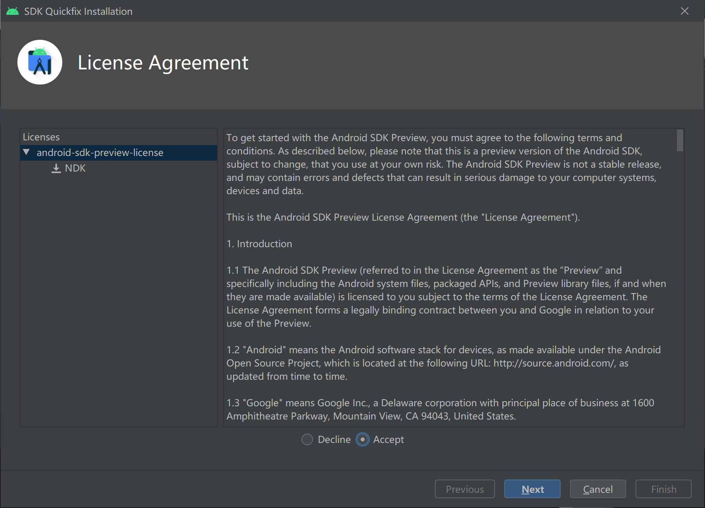
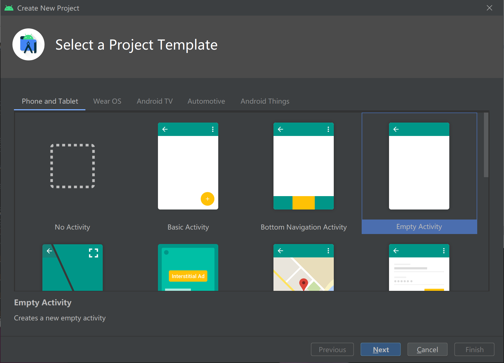

# JDK安装

1. 官网下载对应系统和版本的安装包，安装到指定目录


2. 打开windows环境变量，将java的安装路径添加到环境变量中。在"系统变量(S)"中设置3项属性，分别为：JAVA_HOME,PATH,CLASSPATH(大小写都可以,推荐大写)，若已存在，则点击"编辑"，不存在则点击"新建"

   -  变量名：JAVA_HOME

      变量值：D:\Program Files\Java\jdk-13.0.2;（注：此处为你的jdk安装路径）

   - 变量名：CLASSPATH

     变量值：%JAVA_HOME%\lib\dt.jar;%JAVA_HOME%\lib\tools.jar;

   - 变量名：CLASSPATH

     变量值：%JAVA_HOME%\bin;%JAVA_HOME%\jre\bin；(注：不要清空掉path中的其他环境变量，应该养成经常备份环境变量的习惯！！！)

3. 点击“确认”保存，ok！到此为止，java环境便配置完成。

4. 点击"开始"--->"运行"（或按下win+R），键入"cmd";在命令行中输入“java -version”、“java”显示如下环境就说明环境配置成功！

# Android Studio安装

1. 官网下载与版本相对应安装包，双击安装。正式安装之前，最好先准备两个文件夹：一个用来存放安装程序，一个用来存放SDK。**注意：SDK路径不要带空格！** 


2. 正式安装


**取消打开AS的对勾，切记！**


3. 修改Android Studio路径配置否则默认安装路径在c盘

```
idea.config.path=D:/Android/.AndroidStudio/config
idea.system.path=D:/Android/.AndroidStudio/system
idea.plugins.path=D:/Android/.AndroidStudio/plugins
idea.log.path=D:/Android/.AndroidStudio/log
```


然后保存退出。

# Android SDK安装

这里可以通过下载SDK包安装配置环境变量或者直接通过Android Studio安装

1. 软件包安装

这里下载了软件包：


将其解压到要安装的sdk目录


打开sdk manage下载一些sdk工具包，选择默认的即可


安装完成后配置环境变量：

PATH:  D:\Android\SDK\platform;D:\Android\SDK\tools

打开sdk manage下载一些sdk工具包，选择默认的即可

cmd测试：adb工具

2. Android Stutio安装

- 打开Android Stutio


选择自定义设置


选择刚刚安装的jdk目录


选择下载sdk和选择sdk路径，如果已经安装了sdk就选择不下载直接选择sdk安装路径即可


点击完成开始下载sdk


下载完成后配置环境变量即可（下载较慢）

# 安装NDK

如果没有安装ndk在android studio中可以自动安装。




# 配置Gradle




