# 虚拟环境搭建

此处省略一万字

# 基础网站搭建

## http

http含义：超文本传输协议

http头讲解

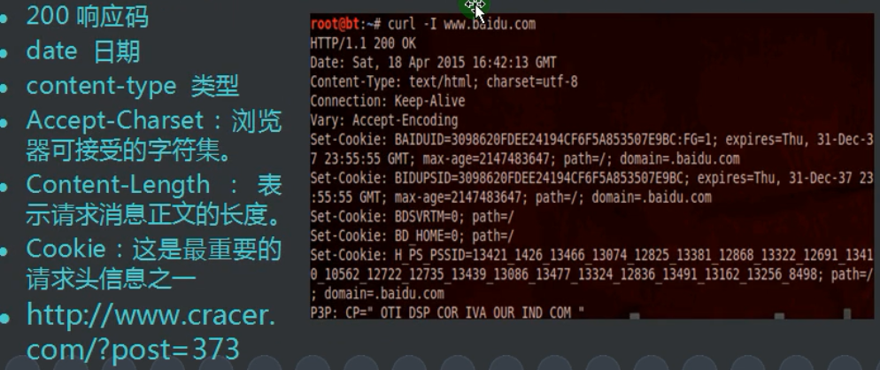

## 静态网站

全部由html代码格式页面组成的网站，所有的内容都包含在网页文件中。

## 动态网站

网站内容可根据不用的情况动态改变，一般是通过数据库进行架构，一般以asp，jsp，php，aspx等结束。

## 网站搭建

- 进入windows server 2003，进入管理服务器
- 点击添加或删除角色， 然后下一步

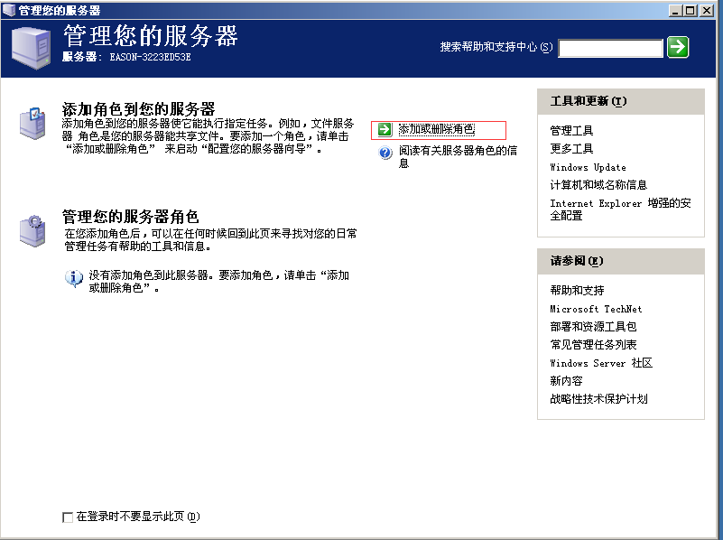

- 选择自定义配置然后下一步

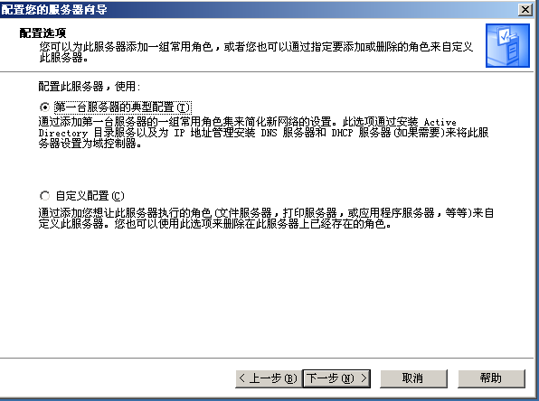

- 选择asp网站搭建服务并下一步

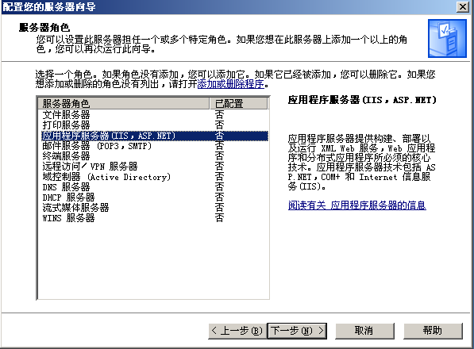

- 选择安装然后下一步

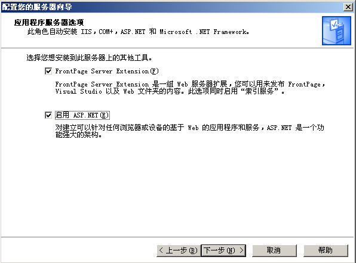

- 然后安装完成

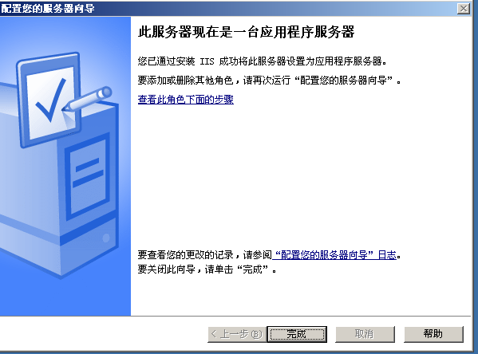

- 网上下载asp服务源码
- 在  开始   管理工具中找到IIS管理器
- 右键新建网站然后下一步，其他均为默认或者跟着教程走

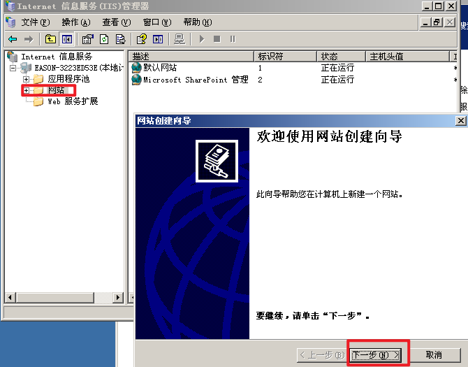

- 新建网站后右键配置属性

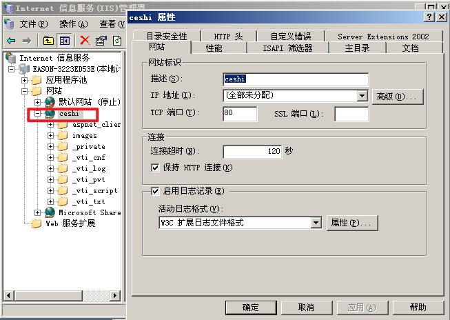

- 修改默认文档为index.asp，然后点击确定

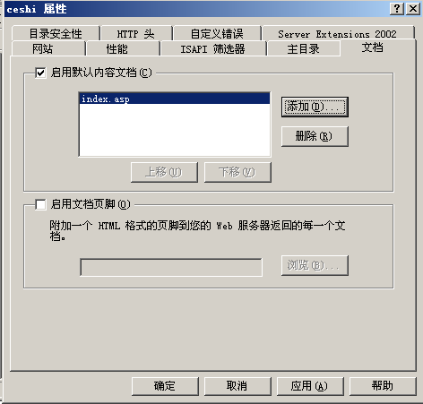

- 然后修改权限为所有人可读

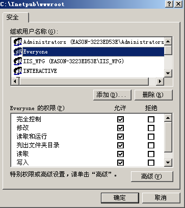

- 然后网上下载asp网站源代码放入网站目录中，
- 在web服务扩展中启动 active server pages

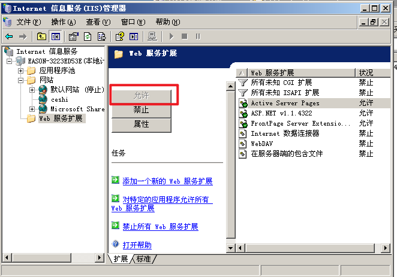

- 将属性的执行权限改为纯脚本

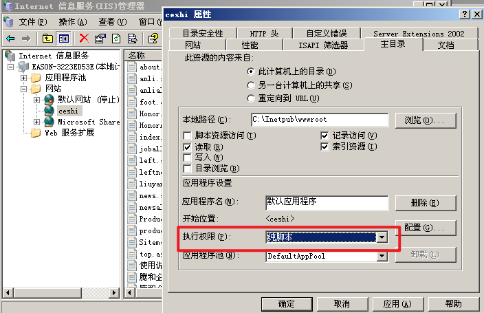

- 点击配置  选项 启用父路径   和 调试  启用asp， 然后确定后重启网站，然后就可以访问网站了。

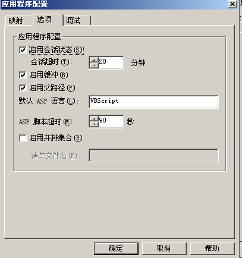

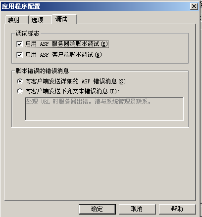