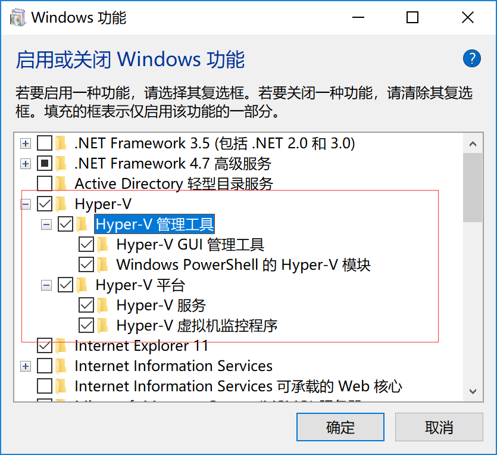

# 1 简介
## 1.1 介绍 

Docker 是一个开源的应用容器引擎，基于 Go 语言 并遵从Apache2.0协议开源。
Docker 可以让开发者打包他们的应用以及依赖包到一个轻量级、可移植的容器中，然后发布到任何流行的 Linux 机器上，也可以实现虚拟化。
容器是完全使用沙箱机制，相互之间不会有任何接口（类似 iPhone 的 app）,更重要的是容器性能开销极低。
Docker 从 17.03 版本之后分为 CE（Community Edition: 社区版） 和 EE（Enterprise Edition: 企业版），我们用社区版就可以了。

## 1.2 应用场景

- Web 应用的自动化打包和发布。
- 自动化测试和持续集成、发布。
- 在服务型环境中部署和调整数据库或其他的后台应用。
- 从头编译或者扩展现有的 OpenShift 或 Cloud Foundry 平台来搭建自己的 PaaS 环境。

# 2 Docker架构

Docker 使用客户端-服务器 (C/S) 架构模式，使用远程API来管理和创建Docker容器。
Docker 容器通过 Docker 镜像来创建。
容器与镜像的关系类似于面向对象编程中的对象与类。


 | 
- | -
  Docker 镜像(Images) | Docker镜像是用于创建 Docker 容器的模板。
  Docker 容器(Container) | 容器是独立运行的一个或一组应用。
  Docker 客户端(Client) | Docker 客户端通过命令行或者其他工具使用 [Docker API](https://docs.docker.com/reference/api/docker_remote_api) 与 Docker 的守护进程通信。
  Docker 主机(Host) | 一个物理或者虚拟的机器用于执行 Docker 守护进程和容器。
  Docker 仓库(Registry) | Docker 仓库用来保存镜像，可以理解为代码控制中的代码仓库。[Docker Hub](https://hub.docker.com)提供了庞大的镜像集合供使用。
  Docker Machine | Docker Machine是一个简化Docker安装的命令行工具，通过一个简单的命令行即可在相应的平台上安装Docker，比如VirtualBox、 Digital Ocean、Microsoft Azure。

# 3 Docker安装与运行

## 3.1 Ubuntu安装Docker

安装Docker 要求 Ubuntu 系统的内核版本高于 3.10 ，查看本页面的前提条件来验证你的 Ubuntu 版本是否支持 Docker。

通过 uname -r 命令查看你当前的内核版本：
    
    pyvip@vip:~$ uname -a
    Linux vip 4.15.0-54-generic #58-Ubuntu SMP Mon Jun 24 10:55:24 UTC 2019 x86_64 x86_64 x86_64 GNU/Linux

### 3.1.1 使用脚本安装


1.更换国内软件源，推荐中国科技大学的源，稳定速度快（可选）

    sudo cp /etc/apt/sources.list /etc/apt/sources.list.bak
    sudo sed -i 's/archive.ubuntu.com/mirrors.ustc.edu.cn/g' /etc/apt/sources.list
    sudo apt update


2.安装需要的包

    sudo apt install apt-transport-https ca-certificates software-properties-common curl

3.添加 GPG 密钥，并添加 Docker-ce 软件源，这里还是以中国科技大学的 Docker-ce 源为例

    curl -fsSL https://mirrors.ustc.edu.cn/docker-ce/linux/ubuntu/gpg | sudo apt-key add -
    sudo add-apt-repository "deb [arch=amd64] https://mirrors.ustc.edu.cn/docker-ce/linux/ubuntu \
    $(lsb_release -cs) stable"

4.添加成功后更新软件包缓存

    sudo apt update

5.安装 Docker-ce

    sudo apt install docker-ce

6.设置开机自启动并启动 Docker-ce（安装成功后默认已设置并启动，可忽略）

    sudo systemctl enable docker
    sudo systemctl start docker

 

7.测试运行

    sudo docker run hello-world

8.添加当前用户到 docker 用户组，可以不用 sudo 运行 docker（可选）

    sudo groupadd docker
    sudo usermod -aG docker $USER

9.测试添加用户组（可选）

    docker run hello-world

### 3.1.2 命令行安装

    sudo snap install docker     # version 18.06.1-ce, or
    sudo apt  install docker.io

### 3.1.3 启动docker后台服务


    sudo service docker start


​    
## 3.2 [CentOS安装](https://www.runoob.com/docker/centos-docker-install.html)


## 3.3 [Windows安装](https://www.runoob.com/docker/windows-docker-install.html)

### 3.3.1 win7

win7、win8 等需要利用 docker toolbox 来安装，国内可以使用阿里云的镜像来下载，下载地址：http://mirrors.aliyun.com/docker-toolbox/windows/docker-toolbox/docker 

toolbox 是一个工具集，它主要包含以下一些内容：


- Docker CLI 客户端，用来运行docker引擎创建镜像和容器
- Docker Machine. 可以让你在windows的命令行中运行docker引擎命令
- Docker Compose. 用来运行docker-compose命令
- Kitematic. 这是Docker的GUI版本
- Docker QuickStart shell. 这是一个已经配置好Docker的命令行环境
- Oracle VM Virtualbox. 虚拟机

下载完成之后直接点击安装，安装成功后，桌边会出现三个图标，入下图所示：


点击 Docker QuickStart 图标来启动 Docker Toolbox 终端。

如果系统显示 User Account Control 窗口来运行 VirtualBox 修改你的电脑，选择 Yes。
接下来就可以执行命令了。

### 3.3.2 win10

现在 Docker 有专门的 Win10 专业版系统的安装包，需要开启Hyper-V。

1.开启Hyper-V
选择程序与功能->启动和关闭windows功能
打开Hyper-V

2.安装 Toolbox

最新版 Toolbox 下载地址： https://www.docker.com/get-docker
点击 `Download Desktop and Take a Tutorial`，并下载 Windows 的版本，如果你还没有登录，会要求注册登录。

3.运行安装文件

双击下载的 Docker for Windows Installer 安装文件，一路 Next，点击 Finish 完成安装。

安装完成后，Docker 会自动启动。通知栏上会出现个小鲸鱼的图标
，这表示 Docker 正在运行。桌边也会出现三个图标。
我们可以在命令行执行 docker version 来查看版本号，docker run hello-world 来载入测试镜像测试。
如果没启动，你可以在 Windows 搜索 Docker 来启动。

## 3.4 镜像加速


鉴于国内网络问题，后续拉取 Docker 镜像十分缓慢，我们可以需要配置加速器来解决，我使用的是网易的镜像地址：http://hub-mirror.c.163.com（或者其他）。新版的 Docker 使用 /etc/docker/daemon.json（Linux） 或者 %programdata%\docker\config\daemon.json（Windows） 来配置 Daemon。请在该配置文件中加入（没有该文件的话，请先建一个）：


    {
    "registry-mirrors": ["http://hub-mirror.c.163.com"]
    }

# 4 Docker的使用

## 4.1 客户端
docker 客户端非常简单 ,我们可以直接输入 docker 命令来查看到 Docker 客户端的所有命令选项。

    tys@tys:~$ docker

可以通过命令 docker command --help 更深入的了解指定的 Docker 命令使用方法。例如我们要查看 docker stats 指令的具体使用方法：

    tys@tys:~$ docker status --help

### 4.1.1 运行容器

Docker 允许你在容器内运行应用程序， 使用 docker run 命令来在容器内运行一个应用程序。
```
tys@tys:~$ docker run ubuntu:15.10 /bin/echo "Hello world"
Unable to find image 'ubuntu:15.10' locally
15.10: Pulling from library/ubuntu
7dcf5a444392: Pull complete
759aa75f3cee: Pull complete
3fa871dc8a2b: Pull complete
224c42ae46e7: Pull complete
Digest: sha256:02521a2d079595241c6793b2044f02eecf294034f31d6e235ac4b2b54ffc41f3
Status: Downloaded newer image for ubuntu:15.10
Hello world
```
参数解析：
| 参数                    | 含义                                                         |
| ----------------------- | ------------------------------------------------------------ |
| docker                  | Docker 的二进制执行文件。                                    |
| run                     | 与前面的 docker 组合来运行一个容器。                         |
| ubuntu:15.10            | 指定要运行的镜像，Docker首先从本地主机上查找镜像是否存在，如果不存在，Docker 就会从镜像仓库 Docker Hub 下载公共镜像。 |
| /bin/echo "Hello world" | 在启动的容器里执行的命令                                     |

### 4.1.2 运行交互式容器

我们通过docker的两个参数 -i -t，让docker运行的容器实现"对话"的能力

    tys@tys:~$ docker run -i -t ubuntu:15.10 /bin/bash
    root@27986afa288d:/#

参数解析：
| 参数 | 含义                                        |
| ---- | ------------------------------------------- |
| -i   | 允许你对容器内的标准输入 (STDIN) 进行交互。 |
| -t   | 在新容器内指定一个伪终端或终端。            |


此时我们已进入一个 ubuntu15.10系统的容器内部。
我们尝试在容器中运行命令 cat /proc/version和ls分别查看当前系统的版本信息和当前目录下的文件列表

```
root@27986afa288d:/# cat /proc/version
Linux version 4.4.0-138-generic (buildd@lcy01-amd64-006) (gcc version 5.4.0 20160609 (Ubuntu 5.4.0-6ubuntu1~16.04.10) ) #164-Ubuntu SMP Tue Oct 2 17:16:02 UTC 2018
root@27986afa288d:/# ls
bin   dev  home  lib64  mnt  proc  run   srv  tmp  var
boot  etc  lib   media  opt  root  sbin  sys  usr
```

我们可以通过运行exit命令或者使用CTRL+D来退出容器。

### 4.1.3 启动容器（后台模式）

使用以下命令创建一个以进程方式运行的容器

    tys@tys:~$ docker run -d ubuntu:15.10 /bin/sh -c "while true; do echo hello world; sleep 1; done"
    6b0531d832ec86ac6b0cb7d4b66f2fe7e44996b2694a8e43d1ad374916a3525f


在输出中，我们没有看到期望的"hello world"，而是一串长字符，这个长字符串叫做容器ID，对每个容器来说都是唯一的，我们可以通过容器ID来查看对应的容器发生了什么。

首先，我们需要确认容器有在运行，可以通过 docker ps 来查看

    tys@tys:~$ docker ps


CONTAINER ID:容器ID
NAMES:自动分配的容器名称

在容器内使用docker logs命令，查看容器内的标准输出

    tys@tys:~$ docker logs 6b0531d832ec
    
    tys@tys:~$ docker logs dazzling_chaplygin


​    


我们使用 docker stop 命令来停止容器，命令后面指定容器名或者id


    tys@tys:~$ docker stop CONTAINER ID
    tys@tys:~$ docker stop NAMES

## 4.2 Docker镜像

当运行容器时，使用的镜像如果在本地中不存在，docker 就会自动从 docker 镜像仓库中下载，默认是从 Docker Hub 公共镜像源下载。

### 列出本地镜像

    tys@tys:~$ docker images


各个选项说明:
- REPOSITORY：表示镜像的仓库源
- TAG：镜像的标签
- IMAGE ID：镜像
- IDCREATED：镜像创建时间
- SIZE：镜像大小


同一仓库源可以有多个 TAG，代表这个仓库源的不同个版本，如ubuntu仓库源里，有15.10、14.04等多个不同的版本，我们使用 REPOSITORY:TAG 来定义不同的镜像。所以我们再运行容器的时候要指定镜像和版本。

    tys@tys:~$ docker run -d ubuntu:15.10 /bin/sh

如果你不指定一个镜像的版本标签，例如你只使用 ubuntu，docker 将默认使用 ubuntu:latest 镜像。

### 获取镜像

当我们在本地主机上使用一个不存在的镜像时 Docker 就会自动下载这个镜像。如果我们想预先下载这个镜像，我们可以使用 docker pull 命令来下载它。
下载完成后，我们可以直接使用这个镜像来运行容器。
    
    tys@tys:~$ docker pull ubuntu:13.10

### 查找镜像

我们可以从[ Docker Hub ](https://hub.docker.com/)网站来搜索镜像。我们也可以使用 docker search 命令来搜索镜像。比如我们需要一个httpd的镜像来作为我们的web服务。我们可以通过 docker search 命令搜索 httpd 来寻找适合我们的镜像。

    tys@tys:~$ docker search httpd


- NAME:镜像仓库源的名称
- DESCRIPTION:镜像的描述
- OFFICIAL:是否docker官方发布

我们决定使用上图中的httpd 官方版本的镜像，使用命令 docker pull 来下载镜像。

    tys@tys:~$ docker pull httpd

下载完成后，我们就可以使用这个镜像了。

### 自定义镜像

当我们从docker镜像仓库中下载的镜像不能满足我们的需求时，我们可以通过以下两种方式对镜像进行更改。
1. 从已经创建的容器中更新镜像，并且提交这个镜像
2. 使用 Dockerfile 指令来创建一个新的镜像

#### 更新镜像
更新镜像之前，我们需要使用镜像来创建一个容器。

    tys@tys:~$ docker run -t -i ubuntu:15.10 /bin/bash
    root@e218edb10161:/# 

在运行的容器内使用 apt-get update 命令进行更新。在完成操作之后，输入 exit命令来退出这个容器。此时ID为e218edb10161的容器，是按我们的需求更改的容器。我们可以通过命令 docker commit来提交容器副本。

    tys@tys:~$ docker commit -m="has update" -a="eason" e218edb10161 eason/ubuntu:v2
    sha256:70bf1840fd7c0d2d8ef0a42a817eb29f854c1af8f7c59fc03ac7bdee9545aff8


各个参数说明：
- -m:提交的描述信息
- -a:指定镜像作者
- e218edb10161：容器ID
- eason/ubuntu:v2:指定要创建的目标镜像名

我们可以使用 docker images 命令来查看我们的新镜像.

使用我们的新镜像 runoob/ubuntu 来启动一个容器


    tys@tys:~$ docker run -t -i eason/ubuntu:v2 /bin/bash                            
    root@1a9fbdeb5da3:/#

#### 构建镜像

使用命令 docker build ， 从零开始来创建一个新的镜像。为此，我们需要创建一个 Dockerfile 文件，其中包含一组指令来告诉 Docker 如何构建我们的镜像。

    tys@tys:~$ vim Dockerfile

```

FROM    centos:6.7
MAINTAINER      Fisher "fisher@sudops.com"

RUN     /bin/echo 'root:123456' |chpasswd
RUN     useradd runoob
RUN     /bin/echo 'runoob:123456' |chpasswd
RUN     /bin/echo -e "LANG=\"en_US.UTF-8\"" >/etc/default/local
EXPOSE  22
EXPOSE  80
CMD     /usr/sbin/sshd -D
```

每一个指令都会在镜像上创建一个新的层，每一个指令的前缀都必须是大写的。
第一条FROM，指定使用哪个镜像源
RUN 指令告诉docker 在镜像内执行命令，安装了什么。。。
然后，我们使用 Dockerfile 文件，通过 docker build 命令来构建一个镜像。

    tys@tys:~$ docker build -t eason/centos:6.7 .


​    
参数说明：
- -t ：指定要创建的目标镜像名
- . ：Dockerfile 文件所在目录，可以指定Dockerfile 的绝对路径

使用docker images 查看创建的镜像已经在列表中存在

### 设置镜像标签

使用 docker tag 命令，为镜像添加一个新的标签。

    tys@tys:~$ docker tag 860c279d2fec eason/centos:dev

docker tag 镜像ID，这里是 860c279d2fec ,用户名称、镜像源名(repository name)和新的标签名(tag)。
使用 docker images 命令可以看到，ID为860c279d2fec的镜像多一个标签。

## 4.3 Docker容器
docker容器就相当于镜像的一个实例（进程），一个镜像可以对应多个容器，当使用docker run命令时会自动创建一个容器然后运行，也可以多次run一个镜像，创建多个容器同时运行（类似于多进程）。

接下来介绍容器（
以docker容器中运行一个 Python Flask 应用来运行一个web应用为例。）

### 运行容器

前面介绍了几种运行容器的方法，这里主要说后台运行，使用`docker run`命令来运行一个润麒
    
    tys@tys:~$ docker pull training/webapp  # 载入镜像
    tys@tys:~$ docker run -d -P training/webapp python app.py  运行容器

参数说明:
- -d:让容器在后台运行。
- -P:将容器内部使用的网络端口映射到我们使用的主机上。
- training/webapp:指定镜像
- python app.py: 运行指令

### 查看容器

使用 docker ps 来查看我们正在运行的容器：
```
runoob@runoob:~#  docker ps
CONTAINER ID        IMAGE               COMMAND             ...        PORTS                 
d3d5e39ed9d3        training/webapp     "python app.py"     ...        0.0.0.0:32769->5000/tcp

```

这里多了端口信息，表示Docker 开放了 5000 端口（默认 Python Flask 端口）映射到主机端口 32769 上。

    PORTS
    0.0.0.0:32769->5000/tcp


我们也可以通过 -p 参数来设置不一样的端口：

    runoob@runoob:~$ docker run -d -p 5000:5000 training/webapp python app.py


docker ps查看正在运行的容器
```
runoob@runoob:~#  docker ps
CONTAINER ID        IMAGE                             PORTS                     NAMES
bf08b7f2cd89        training/webapp     ...        0.0.0.0:5000->5000/tcp    wizardly_chandrasekhar
d3d5e39ed9d3        training/webapp     ...        0.0.0.0:32769->5000/tcp   xenodochial_hoov
```

容器内部的 5000 端口映射到我们本地主机的 5000 端口上。
### 查看端口映射

通过 docker ps 命令可以查看到容器的端口映射，docker 还提供了另一个快捷方式 docker port，使用 docker port 可以查看指定 （ID 或者名字）容器的某个确定端口映射到宿主机的端口号。
上面我们创建的 web 应用容器 ID 为 bf08b7f2cd89 名字为 wizardly_chandrasekhar。我可以使用 docker port bf08b7f2cd89 或 docker port wizardly_chandrasekhar 来查看容器端口的映射情况。

```
runoob@runoob:~$ docker port bf08b7f2cd89
5000/tcp -> 0.0.0.0:5000runoob@runoob:~$ docker port wizardly_chandrasekhar
5000/tcp -> 0.0.0.0:5000
```

### 查看 WEB 应用程序日志


docker logs [ID或者名字] 可以查看容器内部的标准输出。

```

runoob@runoob:~$ docker logs -f bf08b7f2cd89
 * Running on http://0.0.0.0:5000/ (Press CTRL+C to quit)192.168.239.1 - - [09/May/2016 16:30:37] "GET / HTTP/1.1" 200 -192.168.239.1 - - [09/May/2016 16:30:37] "GET /favicon.ico HTTP/1.1" 404 -
```

-f: 让 docker logs 像使用 tail -f 一样来输出容器内部的标准输出。


### 查看容器的进程

docker top 来查看容器内部运行的进程：

```
runoob@runoob:~$ docker top wizardly_chandrasekhar
UID     PID         PPID          ...       TIME                CMD
root    23245       23228         ...       00:00:00            python app.py

```
### 检查 WEB 应用程序

使用 docker inspect 来查看 Docker 的底层信息。它会返回一个 JSON 文件记录着 Docker 容器的配置和状态信息。
```

runoob@runoob:~$ docker inspect wizardly_chandrasekhar
[
    {
        "Id": "bf08b7f2cd897b5964943134aa6d373e355c286db9b9885b1f60b6e8f82b2b85",
        "Created": "2018-09-17T01:41:26.174228707Z",
        "Path": "python",
        "Args": [
            "app.py"
        ],
        "State": {
            "Status": "running",
            "Running": true,
            "Paused": false,
            "Restarting": false,
            "OOMKilled": false,
            "Dead": false,
            "Pid": 23245,
            "ExitCode": 0,
            "Error": "",
            "StartedAt": "2018-09-17T01:41:26.494185806Z",
            "FinishedAt": "0001-01-01T00:00:00Z"
        },......
```
### 停止应用容器

    runoob@runoob:~$ docker stop wizardly_chandrasekhar   
    wizardly_chandrasekhar

### 重启应用容器

已经停止的容器，我们可以使用命令 docker start 来启动。

    runoob@runoob:~$ docker start wizardly_chandrasekhar   
    wizardly_chandrasekhar


​    
通过docker ps -l 查询最后一次创建的容器：

```
runoob@runoob:~$  docker ps -l 
CONTAINER ID        IMAGE                             PORTS                     NAMES
bf08b7f2cd89        training/webapp     ...        0.0.0.0:5000->5000/tcp    wizardly_chandrasekhar
```


正在运行的容器，我们可以使用 docker restart 命令来重启。

### 移除容器

我们可以使用 docker rm 命令来删除不需要的容器

    runoob@runoob:~$ docker rm wizardly_chandrasekhar  
    wizardly_chandrasekhar

删除容器时，容器必须是停止状态，否则会报如下错误

    runoob@runoob:~$ docker rm wizardly_chandrasekhar
    Error response from daemon: You cannot remove a running container   bf08b7f2cd897b5964943134aa6d373e355c286db9b9885b1f60b6e8f82b2b85. Stop the container before attempting removal or force remove

### 容器命名


当我们创建一个容器的时候，docker 会自动对它进行命名。另外，我们也可以使用 --name 标识来命名容器，例如：

    unoob@runoob:~$  docker run -d -P --name runoob training/webapp python app.py
    43780a6eabaaf14e590b6e849235c75f3012995403f97749775e38436db9a441

### 容器连接

端口映射并不是唯一把 docker 连接到另一个容器的方法。docker 有一个连接系统允许将多个容器连接在一起，共享连接信息。docker 连接会创建一个父子关系，其中父容器可以看到子容器的信息。

# 6 实例


# 补充
## Dockerfile指令
### 1. FROM
- 格式：
    - FROM <image>
    - FROM <image>:<tag>
- 说明：指定镜像，在指定镜像的基础上创建新镜像。Dockerfile中第一条指令必须是FROM指令，且在同一个Dockerfile中创建多个镜像时，可以使用多个FROM指令。

### 2. MAINTAINER
- 格式：MAINTAINER <user_name> <user_email>
- 说明：指定维护者信息

### 3.RUN
- 格式：
    - RUN <command>
    - RUN ["EXECUTABLE","PARAM1","PARAM2".....]
- 说明：前者在shell终端中运行命令，`/bin/sh -c command`，例如：`/bin/sh -c "echo hello"`；后者使用exec执行，指定其他运行终端使用`RUN["/bin/bash","-c","echo hello"]`。每条RUN指令将当前的镜像基础上执行指令，并提交为新的镜像，命令较长的时候可以使用`\`来换行。


### 4. CMD
- 支持三种格式：
    - CMD ["executable","param1","param2"]，使用exec执行，这是推荐的方式。
    - CMD command param1 param2 在/bin/sh中执行。
    - CMD ["param1","param2"] 提供给ENTERYPOINT的默认参数。
- 说明：CMD用于指定容器启动时执行的命令，每个Dockerfile只能有一个CMD命令，多个CMD命令只执行最后一个。若容器启动时指定了运行的命令，则会覆盖掉CMD中指定的命令。


### 5. EXPOSE
- 格式为 `EXPOSE port [port2,port3,...]`，例如EXPOSE 80这条指令告诉Docker服务器暴露80端口，供容器外部连接使用。
- 在启动容器的使用使用-P，Docker会自动分配一个端口和转发指定的端口，使用-p可以具体指定使用哪个本地的端口来映射对外开放的端口。

### 6. ENV
- 格式为：`EVN <key> <value>` 。
- 用于指定环境变量，这些环境变量，后续可以被RUN指令使用，容器运行起来之后，也可以在容器中获取这些环境变量。例如
```
ENV word hello
RUN echo $word
```

### 7. ADD
- 格式：ADD <src> <dest>
- 该命令将复制指定本地目录中的文件到容器中的dest中，src可以是是一个绝对路径，也可以是一个URL或一个tar文件，tar文件会自动解压为目录。

### 8. COPY
- 格式为：COPY <src> <dest>
- 复制本地主机src目录或文件到容器的desc目录，desc不存在时会自动创建。


### 9. ENTRYPOINT
- 格式有两种：
    - ENTRYPOINT ["executable","param1","param2"]
    - ENTRYPOINT command param1,param2 会在shell中执行。
- 用于配置容器启动后执行的命令，这些命令不能被docker run提供的参数覆盖。和CMD一样，每个Dockerfile中只能有一个ENTRYPOINT，当有多个时最后一个生效。


### 10. VOLUME
- 格式为 VOLUME ["/data"]
- 作用是创建在本地主机或其他容器可以挂载的数据卷，用来存放数据。


### 11. USER
- 格式为：USER <username>
- 指定容器运行时的用户名或UID，后续的RUN也会使用指定的用户。要临时使用管理员权限可以使用sudo。在USER命令之前可以使用RUN命令创建需要的用户。例如：
  `RUN groupadd -r docker && useradd -r -g docker docker`


### 12. WORKDIR
- 格式： WORKDIR <path>
- 为后续的RUN CMD ENTRYPOINT指定配置工作目录，可以使用多个WORKDIR指令，若后续指令用得是相对路径，则会基于之前的命令指定路径。
### 13. ONBUILD
- 格式 ONBUILD [INSTRUCTION]
- 该配置指定当所创建的镜像作为其他新建镜像的基础镜像时所执行的指令。
  例如下面的Dockerfile创建了镜像A：
```
ONBUILD ADD . /app
ONBUILD RUN python app.py
```
则基于镜像A创建新的镜像时，新的Dockerfile中使用from A 指定基镜像时，会自动执行ONBBUILD指令内容，等价于在新的要构建镜像的Dockerfile中增加了两条指令：
```
FROM A
ADD ./app
RUN python app.py
```
### 14. docker build
创建好Dockerfile之后，通过docker build命令来创建镜像，该命令首先会上传Dockerfile文件给Docker服务器端，服务器端将逐行执行Dockerfile中定义的指令。
通常建议放置Dockerfile的目录为空目录。另外可以在目录下创建.dockerignore文件，让Docker忽略路径下的文件和目录，这一点与Git中的配置很相似。通过 -t 指定镜像的标签信息，例如：docker build -t regenzm/first_image . ##"."指定的是Dockerfile所在的路径