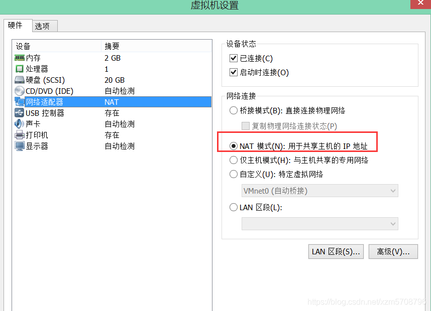
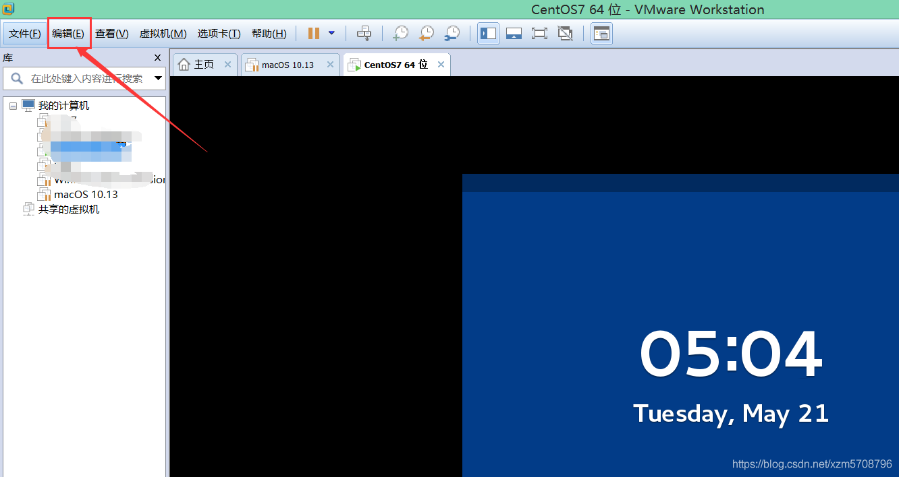
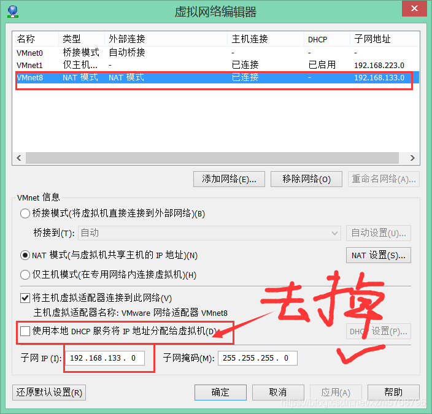
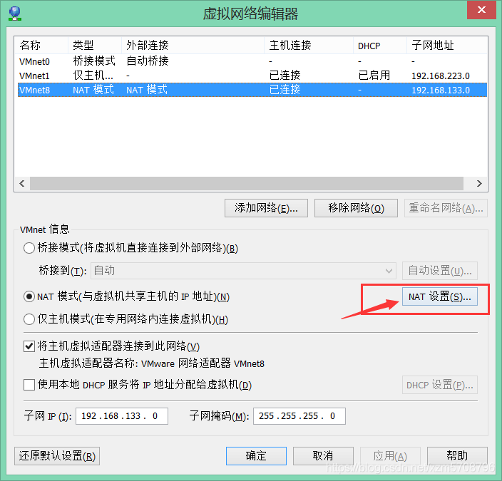
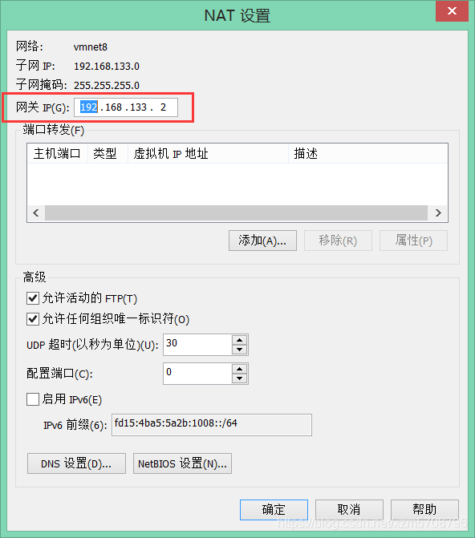

为了方便开发，通过vmware装了一个ubuntu18.04的虚拟机，但是vmware每次打开虚拟机都会更换虚拟机deip，这对我们在本机上通过终端工具连接虚拟机带来了麻烦，因为每次都需要换ip。
所以接下来了解一下如何设置静态ip。

首先查看linux版本：

     cat /etc/issue


这里是Ubuntu18.04版本，每个版本的设置方式不一样。

## 虚拟机配置网络模式：




1. 点击编辑–虚拟网络编辑器，记录查看默认分配的网卡IP信息内容



2. 修改DHCP配置，去掉使用本地DHCP服务将IP地址分配给虚拟机的选项




3. 点击VMnet8 NAT模式的内容，点击NAT设置查看




4. 记录网关地址（在配置网卡时需要进行配置）



## 修改ip

1. 找到静态网卡配置文件，进行修改

```
# 
cd /etc/netplan 
#查看配置网卡文件 
ll
```


2.修改文件

你们文件名字可能不一样，记得修改


    sudo vi 01-network-manager-all.yaml


​    

3.修改为如下内容

```
network:
  version: 2
  renderer: networkd
  ethernets:
    ens33:
      addresses:
        - 192.168.133.136/24
      gateway4: 192.168.133.2
      nameservers:
          addresses: [192.168.133.2, 8.8.8.8]
```

说明：
addresses：你要修改为的静态IP地址
gateway4：你的虚拟机的网关地址（若不知道网关地址在哪里看，飞机去：windows下VM安装centos7配置静态IP并且可以访问网络(高清无码☺)）
nameservers：你的DNS地址


4.应用你修改的配置


    sudo netplan apply


5.测试情况