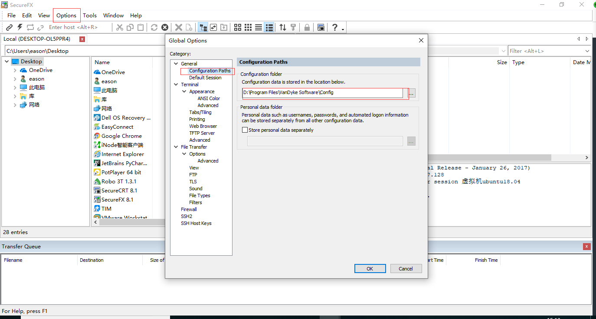

# 处理SecureFX中的中文乱码的问题
当使用SecureFX连接linux时，如果linux中包含中文，就会出现中文乱码。
1. 首先打开SecureFX，在菜单中选择
    “Options”-"Global Options…"

在“Global Options”窗口中，选择“General”-"Configuration Path"，找到SecureFX配置文件所在的路径(可更改)；

进入到该目录中，选择“Sessions”，找到链接地址的ini文件，并用文本编辑器打开；
![Image [2]](处理SecureFX中的中文乱码的问题.assets/Image [2].png)

在打开的ini文件中，查找：Filenames Always Use UTF8；
将Filenames Always Use UTF8后面的值修改为：00000001，保存退出；
![Image [3]](处理SecureFX中的中文乱码的问题.assets/Image [3].png)

再次打开SecureFX，进入到含有中文名称的文件目录中，可以看到含有中文名称的文件已经能够正常显示了。