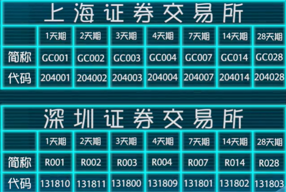

# 基金的分类
## 开放式基金
从一级市场或者场外市场直接可以买到的基金，可直接从第三方平台进行申购和赎回的基金。
根据投资对象的不同，可分为股票基金、债券基金、货币市场基金、混合型基金等。
资本市场：股票和一千长期债券
货币市场：短期债券和各类票据
投资风险：股票基金 > 混合型基金 > 债券基金 > 货币市场基金
### 基金的名字：
1. 基金公司的名字  天弘 华夏  易方达 南方等
2. 基金特点或者偏好  经济环保 中小盘等
3. 基金投资范围  货币，指数，ETF, QDII等，对投资做了限定
## 封闭式基金
只能在二级市场或者场内市场进行买卖的基金，不能进行直接的申购和赎回，只能在二级市场从其他投资者手里买入卖出。
约定封闭期，到期清盘或者封转开。

# 货币基金

## 余额宝
1. T+0实时到账
2. 7 * 24小时赎回服务
3. 工作日三点前申购，第二天确认份额，第三天计算利息，如果周四三点后申购算周五的申购，周末不上班，周一确认份额，周二计算利息。
4. 按日计算收益， 复利效益
5. 赎回手续费

## 支付宝免费体现办法
1. 下载网商银行app，使用支付宝账户注册登录并绑定银行卡
2. 首页点击转账，将支付宝的钱转入到网商银行
3. 将网商银行的钱转出到银行卡

## 微信免费体现办法
1. 将常用信用卡绑定到微信钱包
2. 使用信用卡还款功能将钱转入到信用卡
3. 从信用卡取出钱，下载银行对应的app将信用卡的钱转到借记卡。

## 普通场外货币基金
### 收益
收益率不高但是搞安全性和搞流动性。收益率2到5个点。
现金流规划工具：3到6个月的家庭支出金额作为家庭紧急备用金。
资金避风港：随时可以卖出然后买入股票等
### 风险
1. 通胀风险
2. 流动性风险
3. 亏损风险负收益
4. 盗号风险

## 投资技巧
1. 七日年化收益

七日年化收益率是货币基金过去七天每万份基金份额净收益折合成的年收益率。

2. 每万分收益
  货基的净值都是1元，1万份额一天的收益叫每万分收益，收益会转化成货基的份额，只能看一天的收益

3. 看过去半年一年的长时间累计回报

[天天基金网](http://fund.eastmoney.com/data/hbxfundranking.html#t;c0;r;sSYL_5N;ddesc;pn50;mg;os1;)查看基金排行。

4. 不建议频繁更换货币基金

5. 名字后面不带字母ABC的

A代表A类，一百一千元起卖，B类五百万起卖，为了区分个人和机构。利率歧视

6. 传统货基费用
  每年收取：
  基金管理费：0.33%  > 基金公司
  基金托管费：0.1%  > 基金托管银行
  销售服务费：0.25% >销售渠道如天天基金网

7. 因为利息日结导致本金太少无法获取收益
8. 节假日前夕提前买货基

## 场内货币基金（货币ETF）

ETF基金：交易型开放式指数基金，成本最低交易最方便

货币ETF：尽量挑选规模大的，才有足够多的流动性

### 华宝添益
#### 规则
1. 交易时间跟股市开盘时间一致
2. 每天可无限次买卖 T+0回转交易，瞬间到账
3. 超过70家券商免收华宝添益的佣金
4. 场外场内均无最高限额
5. 净值100元，100份起卖称为一手
6. 一级市场净值和二级市场交易价格，交易价格随着净值进行波动
7. 每月结算利息，分红折算基金份额
#### 套利策略
知道的人越少越好
1. 二级市场低买高卖，极端波动情况，季末或者年末市场资金紧张
2. 买入赎回套利：二级市场低于100的价格买入（代码511990）再到一级市场以100的价格赎回（赎回代码511991）
3. 普通货基收益计算方法算尾不算头，华宝添益场内算头不算尾，即买入当天算收益卖出当天不算，周四折价买入等周五赎回，可享受周末两天货基收益。
#### 缺点
耗时，机会越来越少

### 银华日利
#### 规则
1. 收益折算到基金净值中，每年通过分红降低基金净值到100元
2. 套利方法与华宝添益一样， 511880和511881
3. 潜在套利收益更高但是操作更麻烦，二级市场无法看出涨跌，得对比当天发布的净值
### 理财金h

### Shibor
平时买入场外货基，再季末或者年末市场缺钱的时候进入场内玩套利，或者股市突然打仗导致货基资金短缺

如何判断市场时候缺钱？

Shibor：上海银行间同业拆放利率，各大银行借钱的利率
银行的资本充足率必须高于8%，监管机构会在每个季末对银行进行考察。

利率分：隔夜，一周，两周，一个月，三个月

隔夜拆借率体现短期市场是否紧张的关键指标
[shibor官网](http://www.shibor.org/)查看指标，一般再2%到3%之间。

除了货币基金，还有一款理财产品受shibor严重影响。

### 国债逆回购

国债正回购：持有未到期国债的机构投资者以国债为抵押物借钱，到期再把国债拿回来。

国债逆回购：个人通过国债回购市场把自己的资金借出去，获得固定的利息收益；而回购方，也就是借款人用自己的国债作为抵押获得这笔借款，到期后还本付息。通俗来讲，就是将资金通过国债回购市场拆出，其实就是一种短期贷款，即你把钱借给别人，获得固定利息；而别人用国债作抵押，到期还本付息。逆回购的安全性超强，等同于国债。

按借款期限分不同品种，最好选7天以内尤其是一天的品种。

沪市：交易门槛十万元，利率高一点， 一年按360天计算收益
深市：交易门槛一千元， 一年按365天计算收益

有手续费，一天期一元两天期两元

无法做日内回转交易

等股市收盘的时候利率可能下降，下手越晚收益越低

[集思录官网](https://www.jisilu.cn)首页转到[现金管理](https://www.jisilu.cn/data/repo/)可看到国债逆回购和货币ETF等详细信息

将定投准备金放入券商的货期理财产品如华泰的天天发，可获得货基的收益，在市场资金紧张的时候再将进行场内货基ETF套利或者购买国债逆回购。

### 定期理财基金
场外版的国债逆回购，收益跟货基无明显差异流动性还不如货基不推荐

### 短债基金和中短债基金
牺牲一定的安全性和流动性获取比货基较高的收益。
1. T+1到账
2. 价格实时波动

# 债券基金
## 分类
按投资期限可分为短债，中短债和长期债券基金
从能否投资股票：
二级债基：可买不超过20%的二级市场股票
一级债基：可在一级市场打新股，风险比二级债基多
纯债基金：不碰股票，推荐
可转债基金：风险高于纯债和一级

### 长期纯债基金

1. 牛市熊市
2. 加息周期降息周期
3. 基金经理的个人实力
4. 发行时间久，长期稳健的基金

挑选方法：在天天基金网的基金排行中挑选近三年收益高的长期纯债，逐一进入基金详情，剔除投资可转债、小公司、规模超过20亿、同一基金公司旗下的非王牌基金，剩下的基金选出综合费率低的，成立时间相对久的，基金经理年龄相对大的，管理该基金时间较长的。

短期存放选择不收取申购赎回费的模式，一年以上选择一次付申购赎回费的模式，推荐后端收费

![ScreenClip [2]](基金.assets/ScreenClip [2].png)

### 定期开放式债基

1. 场外直接申购赎回
2. 封闭运作更高回报，最短半年最长三年，集中

适合长期持有的投资者。

选择方式：
1. 纯债
2. 杠杆率不超过160%
3. 封闭期一年左右

累计净值是衡量一个基金好坏的关键指标
分不分红与基金好坏无关

### 债券指数基金（不推荐）

# 混合型基金

## 分类

按照股票和债券的投资比例
- 偏股混合型基金
- 偏债
- 平衡
- 灵活配置

## 现代资产组合理论

现代资产组合理论的提出主要是针对化解投资风险的可能性。该理论认为，有些风险与其他证券无关，分散投资对象可以减少个别风险（unique risk or unsystematic risk），由此个别公司的信息就显得不太重要。个别风险属于市场风险，而市场风险一般有两种：个别风险和系统风险（systematic risk），前者是指围绕着个别公司的风险，是对单个公司投资回报的不确定性；后者指整个经济所生的风险无法由分散投资来减轻。

## 平衡型基金

风险对冲

# 主动性股票基金
## 挑选技巧
### 基金公司
大型知名的基金公司
### 基金经理
好的基金经理从基金经理的基本背景，学历背景，年龄，从业年限，管理基金的时间
### 操盘风格
短线长线（基金换手率50%-200%）  行业或者主题偏好（医药军工等）

#### 评级机构
晨星、理伯、惠誉

#### 晨星投资风格箱
[晨星中文官网](http://cn.morningstar.com/main/default.aspx)
判断基金投资风格的工具

或者在天天基金网产看基金投资风格。

把影响基金业绩表现最重要的两项因素列出来

1. 规模分为大盘中盘小盘风格
2. 按照股票特性分为价值型平衡性成长性

![ScreenClip [3]](基金.assets/ScreenClip [3].png)

#### 价值型股票与成长型股票
筹码：资金
蓝筹股：大盘股

价值型：当下就有价值的股票，规模大，稳定，收益一般
成长型：前景好风险高收益高
平衡性：又有价值又有成长

### 业绩
- 成立时间足够久
- 业绩保持稳定

1. β系数
  基金跟业绩评价基准之间的相关性，正相关

基金业绩评价基准
- 货币型基金   定期存款利率
- 股票型基金   大盘走势
- 指数型基金   所跟踪的指数

可在天天基金的基金档案中的基本概况找到每个基金的评价基准

高β策略  激进型投资者或者大牛市可获得更高的收益
低β策略  稳健型或者熊市，跟抗跌

2. α系数
  绝对回报，超额收益
  真实收益 - 同时期市场无风险收益（β收益） = 风险收益（α收益）

3. R平方

表明α系数和β系数的精准度

R平方越高表明α系数和β系数的可行度越高

4. 夏普指数
  夏普比率 = (基金回报率-市场无风险回报率)/标准差

评价基金优劣，夏普比率代表基金的性价比越高

5. 特雷诺指数
  反映基金承担单位系统风险所获得的超额收益，指数值越大，承担风险所获得的超额收益越高。

夏普比率 = (基金回报率-市场无风险回报率)/β系数

#### CAPN理论
β系数、α系数、R平方、夏普指数

#### 珐玛三因子模型

 通过β系数、市值和估值来预测股票回报的模型

珐玛研究表明：小市值股票回报大于大市值，低估值价值股回报大于高估值成长股。

### 基金规模
规模不能太大不能太小

投资中小盘基金的规模在10到20亿之间
投资大盘基金的规模在30到100亿之间

### 成本

# 被动型股票指数基金

股票价格指数：用来描述股票市场整体价格水平变化的指标。

## 指数的分类

### 综合指数
在上交所或者深交所的所有股票的加权平均数，展示整个市场的总体水平
1. 上证指数
2. 沪深综合指数

缺点：
1. 存在一定的失真空间
2. 包含的股票鱼龙混杂参差不齐
3. 并不适合做指数基金的标的

### 成分指数
将表现的比较好的股票选出来计算指数，只计算流通股剔除非流通股。

1. 深圳成指：代表深圳市场的重要指数，代表中小盘
2. 深证100指数，代表大盘
3. 上证50  大盘 上交所市值最大的50支股票， 每半年更新一次 金融股和两桶油（中石油中石化）
4. 上证180  大盘 行业分布相对均衡
5. 沪深300  跨越沪深两市，比上证更加全面，代表大中盘
6. 中证500  排除沪深300，代表小盘股，与沪深300大盘风险对冲
7. 中小板 深证，风险最高
8. 创业板 深证，风险最高，波动最大

上证50、沪深300、中证500是中国最具代表的指数

### 行业指数
### 风格指数
### 主题指数

关于指数的发布背景行情成分股信息等可去证券交易所查看
[上交所](http://www.sse.com.cn), [深交税](http://www.szse.cn), [中证公司](http://www.csindex.com.cn)

## 指数基金
让业绩尽可能复制指数的走势，优秀的指数基金对指数的跟踪误差小。
在天天基金网的基金档案中可以查到指数基金的跟踪标的指数和跟踪误差。日跟踪误差在0.5%以内，年跟踪误差不超过1.5%。QDII基金跟踪误差会稍微高一点。

## 主动增强型指数基金
基金经理在一定范围内能够对股票进行调整。
不推荐

## 大数据指数基金
依靠大数据来选择指数成分股的基金。

1. 银河中证腾讯济安价值100指数基金
2. 广发中证百度百发策略100指数基金
3. 博时中证淘金大数据100指数基金

## ETF基金
上市交易型开放式指数基金
可以在二级市场上市交易的基金份额可变的开放式基金，全是指数基金

### 优点
1. 利用效率最高
2. 投资门槛低
3. 管理费低
4. 无印花税
5. 一级市场100万申购
6. 二级市场买卖

### 套利功能
跟实时估值对比二级市场的价格，折价的时候买入，等价格回归甚至易价的时候卖出。
[集思录网站](http://www.jisilu.com)进入ETF基金，溢价率的指标

### 挑选规模较大的

## ETF链接基金
1. 专门去买ETF基金的一种基金
2. 普通开始式基金可以在一级市场操作
3. 超过90%的金额去买对应的ETF基金
4. 持有成本低，管理费低
5. 可定投

## LOF基金
上市型开放式基金
1. 可在二级市场买卖的开放式基金
2. 可实现套利策略

![ScreenClip [4]](基金.assets/ScreenClip [4].png)

### 套利策略
当场外和场内价格差大到扣除套利的交易手续费还有一部分盈利便可以交易。

溢价套利(一级市场买入二级市场赎回)： 场内价格 - 场外净值 >= 1.51% （申购费1.5% + 场内佣金0.1%）
折价套利(二级市场买入一级市场赎回)： 场外净值 - 场内价格 >= 0.51% （赎回费0.5% + 场内佣金0.1%）

折价套利比溢价套利机会更高

集思录可查看LOF基金的交易详情

底仓套利：在基金定投的基础上获得套利机会

## 最有前途的行业指数

市场平均收益：定投沪深300，中证500
更高回报也超高风险：泛教育，泛理财，泛娱乐，泛健康。

泛理财： 
中证金融指数
中证互联网金融指数

泛教育，泛娱乐：
中证教育产业指数
中证娱乐产业指数
中证传媒产业指数
中证影视产业指数
中证文体休闲产业指数
整整TMT产业指数

泛健康：
各种医药医疗指数
互联网医疗指数
中证健康产业指数

一个指数：
中证养老产业指数

# 分级基金（杠杆基金）
杠杆：借钱投资而产生放大效益，同样投资亏损也会放大。
一倍正向杠杆：基金涨一元，投资者收益两元
一倍反向杠杆：基金跌一元，投资者收益一元，反之亦然
分级基金：将普通基金拆分成不用风险等级的两个子基金，一个进攻一个防守，分级A、分级B子基金可在二手市场交易。
分级A约定收益 = 一年期定期存款基准利率 + 1.5%到5%
分级B向分级A借钱然后产生杠杆。
多空分级基金：一个看涨一个看跌，双方对赌，成本最低的杠杆投资模式

母基金净值 = 分级A净值 * 分级A占比 + 分级B净值 * 分级B占比

分级A净值 = 初始净值（1元） + n/365 * 年约定收益率， n代表天数
每隔一段时间分级基金A会将收益分红给持有者然后折算净值到1

## 融资分级基金具体玩法
配对转换机制：
一级市场申购母基金，然后按规定的配比拆分成分级A和分级B，然后再二级市场卖掉。
或者再二级市场按一定比例买入分级A和分级B，再融合成母基金到一级市场赎回。
分级A和分级B的净值与母基金的净值存在恒定关系，但其交易价格会随之波动

### 分级A

集思录注意股票分级栏  修正收益率
隐含收益率 = 约定收益率/分级A的价格 - (分级A的净值 - 1)

选择隐含收益率高的无续存期限的分级A

加息周期时，利率高的分级A（加5%或者固定利率）更容易受到追捧，约定收益率低的分级A（加3%）容易出现折价回归，修正收益率会提高，优先考虑投资
降息周期时，相反，固定利率的分级A更有优势

牛市：收益高的分级B受追捧大幅溢价，分级A就会折价，正式买入的好时机，等牛转熊时分级B暴跌，分级A 就会大涨。
熊市：相反

### 分级B

初始杠杆：分级基金发售时按照分配比例计算的初始杠杆
净值杠杆：分级B净值/母基金净值涨幅
净值杠杆=母基金总净值/B份额总净值=(母基金份数 * 母基金净值)/(B份额份数 * B份额净值)=(母基金净值/B份额净值) * 初始杠杆

价格杠杆=母基金总净值/B份额总市值=(母基金净值/B份额价格) * 初始杠杆=净值杠杆/(1 + 溢价率)

可在集思录的分级基金中找到。

#### 分级基金的折算机制
定期折算机制：分级A的固定分红，分到折算成母基金的份额，从而降低净值
不定期折算机制：
向上折算：保护分级B的杠杆权益， 看母基金净值
向下折算：保护分级A的权益，看B基金净值

#### 适合定投的分级B
1. 深成指B（150023）
  深成指A跌入0.8元一下可买入
  深成指B定投：在0.5元一下可长期定投  （风险高）

2. H股B（150176） 上阈值1.5元， 下阈值0.2元

#### 套利策略

分级A定折套利：分级A定期折算前如果处于折价可在二级市场买入，折算后以一元净值卖出
分级B上折套利：分级B在上折前如果处于折价状态可买入
分级B上折反向套利：在上折之前溢价的时候二级市场卖掉分级B，折价后再买入
分级A和分级B的下折套利：下折前分级A会折价，可买入，
分级B折价可买分级B

拆分合并套利：如果二级市场分别买入分级A和分级B合并成母基金的成本比母基金的净值低，就可套利，扣除母基金赎回费0.5%和子基金的单边买入佣金0.01%共0.51%

拆分卖出套利：二级市场溢价较高，可申购母基金然后拆分到二级市场卖出。

盲拆
拆分的申请母基金份额必须200的整数倍
上交所5万份起不适合玩

